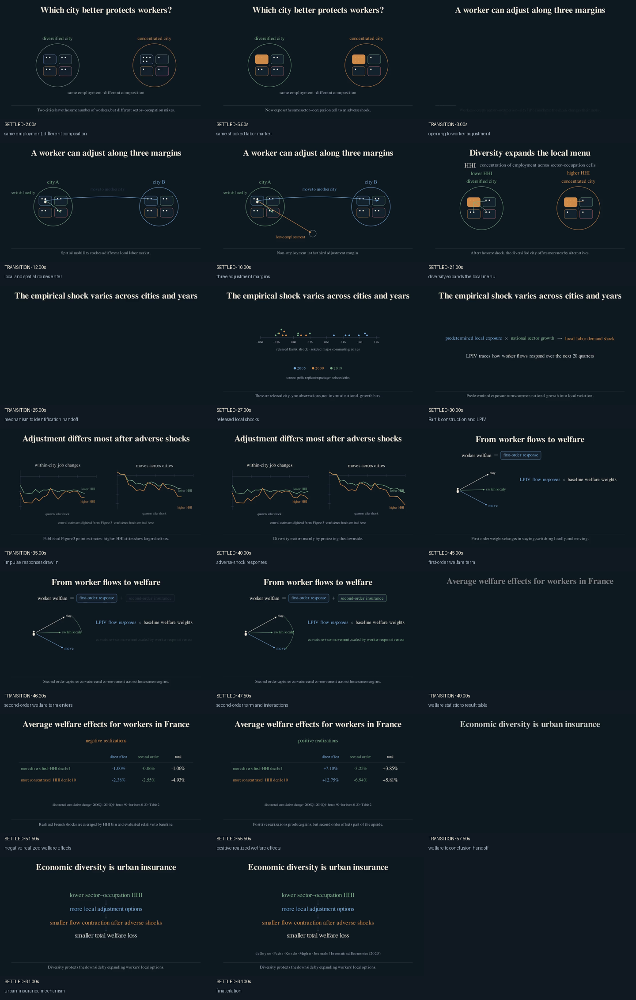

# Manim for Economics

Turn an economics paper into a short, rigorous Manim explainer—without starting
from an empty scene or asking an AI agent to guess what the paper means.

This repository combines:

- A sparse visual system for workers, labor markets, shocks, impulse responses,
  causal chains, linked analytical views, benchmark comparisons,
  decompositions, and welfare.
- A paper brief and timed storyboard that separate economic reasoning from
  animation code.
- Provenance manifests that distinguish released, digitized, and illustrative
  inputs.
- A render/inspection CLI built around cheap previews and contact sheets.
- Durable `AGENTS.md` instructions and a shared Codex skill.
- A readable case study based on “Economic Diversity and the Resilience of
  Cities.”

The intended audience is an economist who has a paper and a visual idea, but
little or no Manim experience.

## See the method in one picture



The contact sheet is generated from settled and transition frames. It is a QA
artifact, not a collage designed after the fact. Named frame labels make the
intended check explicit.

## Quick start

Install [uv](https://docs.astral.sh/uv/), clone the repository, then run:

```bash
uv sync
uv run econ-manim doctor --strict
uv run econ-manim preview starter --overlay
uv run econ-manim frames starter
```

Create your own project:

```bash
uv run econ-manim new my-paper
```

Then edit, in this order:

1. `projects/my-paper/paper_brief.md`
2. `projects/my-paper/data_manifest.toml`
3. `projects/my-paper/storyboard.md`
4. `projects/my-paper/scenes.py`

See [setup](docs/setup.md) for macOS, Windows, Linux, and `pip` instructions.

## Commands

| Command | Purpose |
|---|---|
| `econ-manim doctor` | Diagnose Python, Manim, LaTeX, fonts, and optional FFmpeg |
| `econ-manim new NAME` | Copy the starter into `projects/NAME` |
| `econ-manim preview PROJECT` | Render an 854×480, 15 fps draft |
| `econ-manim preview PROJECT --overlay` | Add title-safe and content-region guides |
| `econ-manim frames PROJECT` | Extract declared inspection frames and a contact sheet |
| `econ-manim qa PROJECT` | Check source, provenance, checksums, and rendered media |
| `econ-manim render PROJECT` | Render the silent 1920×1080, 30 fps master |
| `econ-manim audio PROJECT` | Mix documented music or narration into the master |

All generated output goes below the selected project's `build/` directory and
is ignored by Git.

## The workflow

```text
paper → brief → claim/source crosswalk → storyboard
      → one representative scene → low-quality render
      → settled + transition frames → conceptual check
      → full scene → silent master → optional licensed audio
```

The expensive render is deliberately last. A full video should not be the first
time anyone sees the typography, timing, or transitions.

## Economic-diversity example

The example is a clean reconstruction of the production narrative. It does not
include the 26 historical subclasses, approximately 1 GB of intermediate
renders, restricted worker microdata, or the uncleared soundtrack.

```bash
uv run econ-manim preview examples/economic_diversity --overlay
uv run econ-manim frames examples/economic_diversity
uv run econ-manim render examples/economic_diversity
uv run econ-manim qa examples/economic_diversity
```

Read the [case-study guide](examples/economic_diversity/README.md), the
[published paper](https://doi.org/10.1016/j.jinteco.2025.104184), and the
[CC BY 4.0 replication package](https://doi.org/10.17632/hnxp6dckyp.1).

## Choose a format

Read [visual and narrative formats](docs/visual-formats.md) before writing scene
code. The guide distills patterns from the multimodal-transport and
economic-diversity production videos into:

- a persistent causal chain;
- linked views of one economic state;
- a benchmark-centered comparison;
- a words-first equation build with general operators.

The [format gallery](examples/format_gallery/) is a short, paper-independent
example with explicitly illustrative values:

```bash
uv run econ-manim preview examples/format_gallery --overlay
uv run econ-manim frames examples/format_gallery
```

## Use Codex

Open the repository as a Codex project. The root `AGENTS.md` supplies durable
standards, while `.agents/skills/create-econ-paper-video/` supplies the staged
paper-to-video method.

A useful first request is:

> Use `$create-econ-paper-video`. Read my paper and the starter files. Interview
> me where interpretation is genuinely ambiguous, then produce the paper brief
> and a claim-to-source crosswalk. Do not write animation code yet.

Continue with the checkpoint prompts in
[Using Codex](docs/codex-workflow.md).

## Documentation

- [Install and verify](docs/setup.md)
- [From paper to storyboard](docs/storyboarding.md)
- [Choose visual and narrative formats](docs/visual-formats.md)
- [Use Codex](docs/codex-workflow.md)
- [Protect data integrity](docs/data-integrity.md)
- [Run visual and timing QA](docs/visual-qa.md)
- [Add narration or music](docs/audio.md)
- [Publish responsibly](docs/publishing.md)
- [Troubleshoot](docs/troubleshooting.md)

## License and citation

Code is MIT licensed. Original documentation and example content are CC BY 4.0.
Third-party and paper-specific provenance is recorded in [NOTICE.md](NOTICE.md).
Use `CITATION.cff` to cite the repository.

Manim Community is a separate MIT-licensed project and should also be cited
when appropriate.
