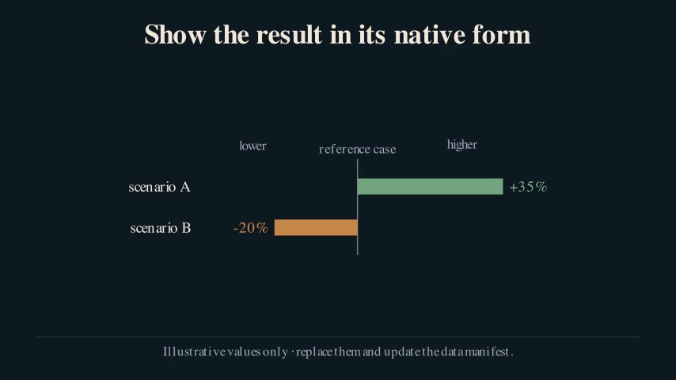
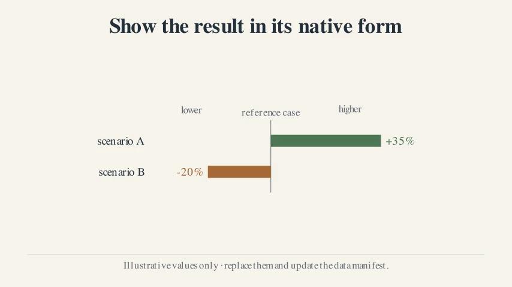

# Choose a visual theme

Narrative structure and visual theme are independent choices. A network paper
does not need a light background, and a choice or welfare paper does not need a
dark one.

List the presets:

```bash
uv run econ-manim themes
```

## Included presets

| Theme | Visual character | Design lineage |
|---|---|---|
| `midnight` | Dark navy field, warm text, muted blue/green/orange accents | The sparse editorial system used for the economic-diversity explainer |
| `ivory` | Warm paper field, dark ink, deeper analytical accents | The light chalkboard system used for the multimodal explainer |

The names describe appearance, not subject matter. The ivory accent colors have
been darkened slightly from the production palette so small text remains
readable against the light background.





## Select a theme

Choose the narrative template and theme separately when creating a project:

```bash
uv run econ-manim new my-paper \
  --template mechanism-led \
  --theme midnight

uv run econ-manim new another-paper \
  --template agent-choice-welfare \
  --theme ivory
```

The selection is stored in `project.toml`:

```toml
[project]
theme = "ivory"
```

Try another theme without editing the project:

```bash
uv run econ-manim preview projects/my-paper --theme midnight
uv run econ-manim preview projects/my-paper --theme ivory
```

An explicit preview override changes the output filename, so both drafts can
coexist.

## Write theme-independent scenes

Use semantic roles from `self.theme`; do not import a preset throughout scene
code:

```python
class PaperExplainer(ResearchScene):
    def construct(self):
        theme = self.theme
        result = DivergingBarChart(
            (
                ("case A", 12, theme.green),
                ("case B", -8, theme.orange),
            ),
            theme=theme,
        )
```

Pass `theme=theme` into reusable components. The role of a color should remain
stable across the entire video—for example, orange for the intervention and
green for the response—not merely look attractive in one frame.

## Add a repository-local preset

Define another `VideoTheme` in `src/econ_manim/theme.py`, register it in
`THEMES`, and add contrast coverage in `tests/test_theme.py`. A preset should
specify semantic colors, not paper-specific labels, logos, or data.

Preview every settled and transition frame after changing themes. Light and
dark palettes can reveal different problems in captions, thin grid lines,
MathTex, and filled cards even when the geometry is unchanged.
