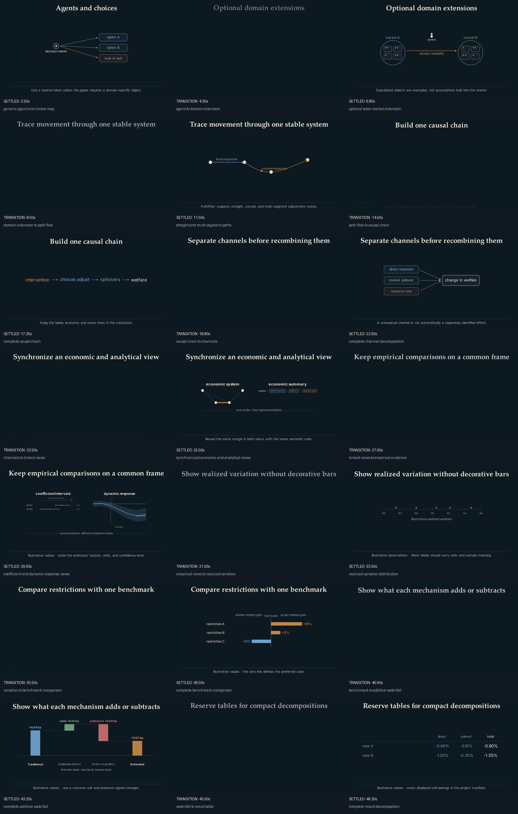
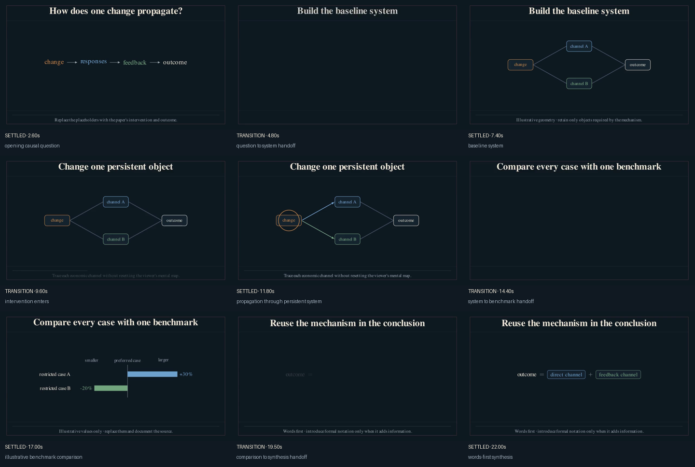
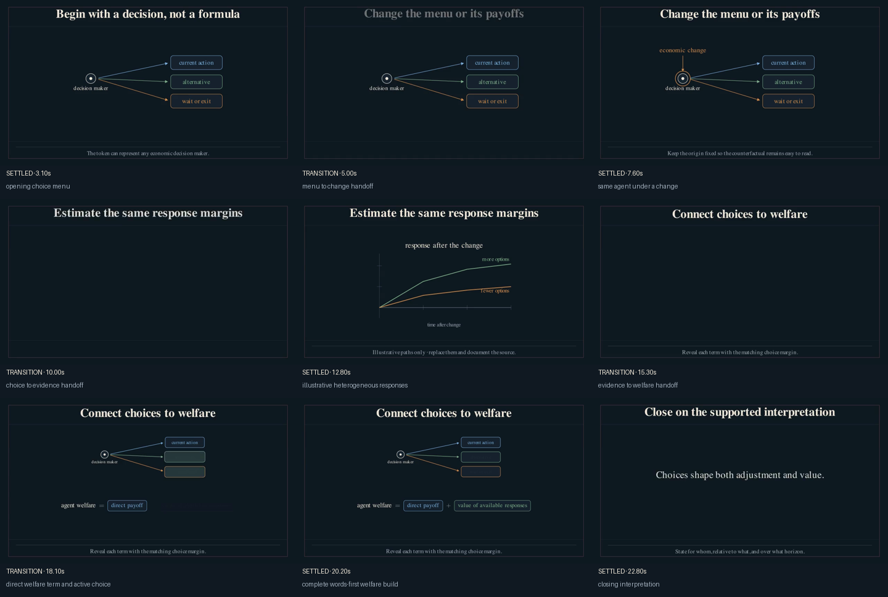

# Choose a visual and narrative format

The format should follow the paper's economic logic. It is not a skin applied
after the storyboard.

Two production explainers informed the specialized project templates:

- The *Multimodal Transport Networks* video is strongest when one network
  persists across construction, intervention, propagation, model comparison,
  and synthesis.
- The economic-diversity video is strongest when one agent's menu connects
  adjustment margins, empirical responses, and a words-first welfare
  decomposition.

The reusable lesson is continuity. A viewer should see the same economic object
change state, not decode a new infographic on every beat.

## Generic core versus paper-specific components

The default starter uses only paper-independent objects:

- `ResearchScene` for stable title, stage, and caption regions;
- `AgentToken` and `ChoiceMap` for a generic decision maker and alternatives;
- `CausalChain` and `LinkedViews` for mechanisms and synchronized
  representations;
- `ImpulseResponsePlot`, `DivergingBarChart`, `ResultTable`,
  `ShockDistribution`, and `EquationBuild` for common analytical forms.

`WorkerToken`, `CityLaborMarket`, and `adjustment_route` remain available
because the diversity case study uses them. They are optional extensions, not
assumptions built into a new project.

## Pick a narrative format

| If the paper's contribution is mainly… | Start from… | Use this sequence |
|---|---|---|
| A mechanism or general-equilibrium propagation | One system and one intervention | question → build → perturb → trace → compare → synthesize |
| Choice, adjustment, or welfare measurement | One agent and its choice menu | agent → change → choices → evidence → decomposition → welfare |
| An empirical result | One estimand and its identifying variation | question → variation → response → heterogeneity → interpretation |
| A method or theorem | One object the method transforms | problem → object → operation → result → comparative static → use |

The first two are complete, copyable projects under
[`templates/projects/`](../templates/projects/). All four have storyboard
templates in [`templates/storyboards/`](../templates/storyboards/).

```bash
uv run econ-manim templates
uv run econ-manim new my-paper --template mechanism-led
uv run econ-manim new my-paper --template agent-choice-welfare
```

## Format 1: causal chain

Use a causal chain when the final takeaway depends on a sequence of economic
responses. Reveal one link at a time, preserve the terms, and reuse them in the
closing expression.

```python
chain = CausalChain(
    (
        ("intervention", ECON_DARK.orange),
        ("choices adjust", ECON_DARK.blue),
        ("spillovers propagate", ECON_DARK.green),
        ("welfare changes", ECON_DARK.foreground),
    )
)
```

This pattern transfers from the multimodal explainer. Its useful feature is not
the arrow style; it is that the opening chain and final welfare statement share
the same mechanism labels.

## Format 2: linked views

Use linked views when a mechanism has a concrete representation and an
analytical representation:

- network and generalized cost;
- choice routes and a welfare term;
- firm choices and an estimating equation;
- market allocation and a planner's objective.

```python
pair = LinkedViews(
    economic_system,
    equation,
    left_title="economic system",
    right_title="economic summary",
    relation="one intervention · two synchronized representations",
)
```

The component handles placement. The scene must handle synchronization: reveal
the same mechanism in both views during the same animation and use the same
semantic color.

Do not use two views merely to fill the frame. If the second view does not add a
distinct representation of the same state, keep one dominant object.

## Format 3: benchmark comparison

Use a diverging chart when every result is defined relative to one benchmark:

```python
chart = DivergingBarChart(
    (
        ("no congestion", 40, ECON_DARK.orange),
        ("fixed choices", -25, ECON_DARK.blue),
    ),
    benchmark_label="full model",
    left_label="smaller implied gain",
    right_label="larger implied gain",
)
```

The zero line carries the comparison. Grow each bar from zero, reveal one row at
a time, and write the baseline in the caption or title. Values remain the
project's responsibility and must appear in `data_manifest.toml`.

## Format 4: words-first equation

`EquationBuild` supports an operator between each pair of terms:

```python
equation = EquationBuild(
    (
        ("direct response", ECON_DARK.blue),
        ("spillovers", ECON_DARK.green),
        ("congestion", ECON_DARK.orange),
    ),
    lhs="welfare",
    operators=("+", "-"),
)
```

Show the left-hand side first. Add one term only when the corresponding margin
is active in the visual. The full mathematical notation can follow later if it
adds information.

## What did not transfer

The starter deliberately does not reproduce:

- four small panels that remain visible while a fifth idea is introduced;
- permanent legends when direct labels work;
- labels that become readable only at 1080p;
- a production script built through inherited version classes;
- a new chart for every sentence;
- illustrative data that resemble estimates without an explicit label.

The production videos contain useful ideas and useful warnings. The public
starter keeps the former and makes the latter harder to repeat.

## See the formats

Render the
[`format_gallery`](../examples/format_gallery/) example:



```bash
uv run econ-manim preview examples/format_gallery --overlay
uv run econ-manim frames examples/format_gallery
```

Compare the complete template contact sheets before choosing:

### Mechanism-led



[Watch the silent 480p preview](../templates/projects/mechanism-led/preview/mechanism_led_preview.mp4).

### Agent, choice, and welfare



[Watch the silent 480p preview](../templates/projects/agent-choice-welfare/preview/agent_choice_welfare_preview.mp4).
