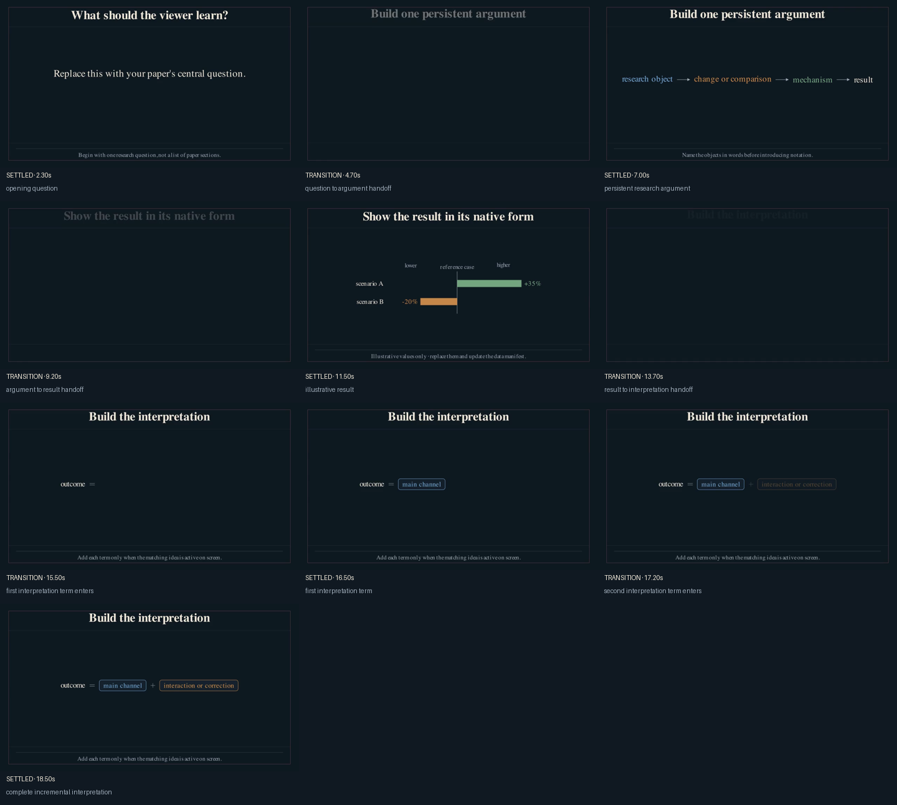
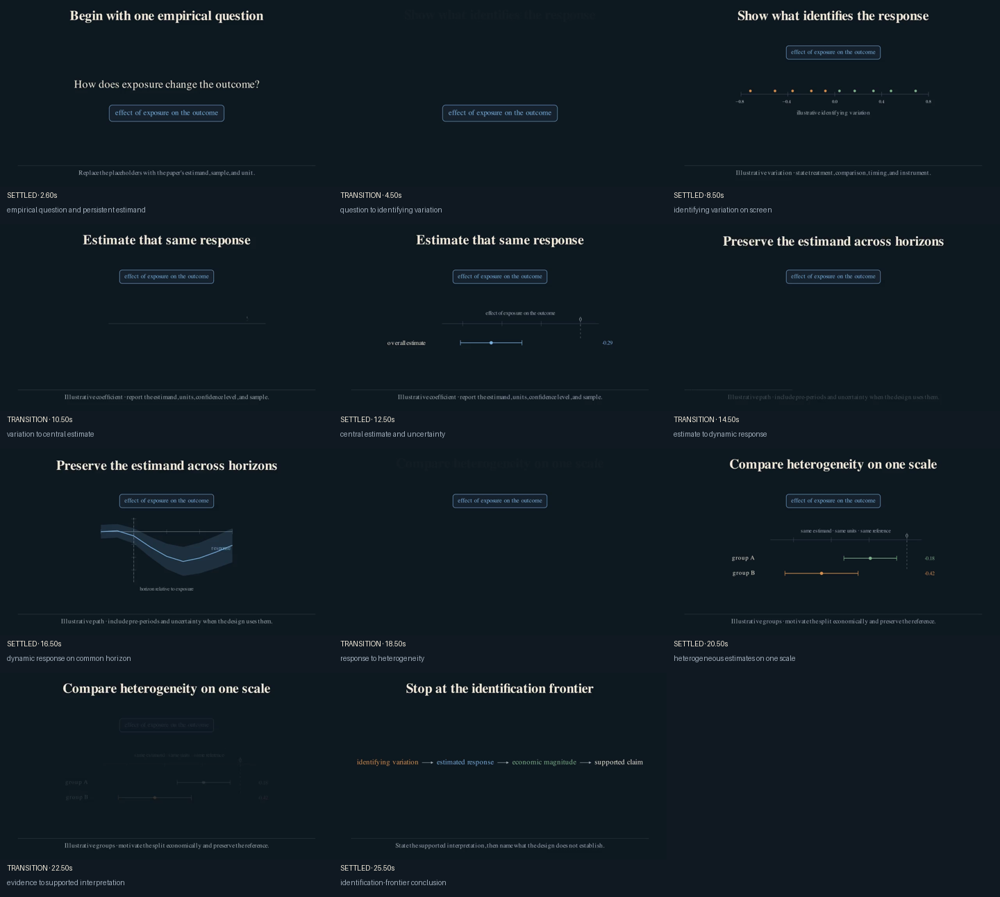
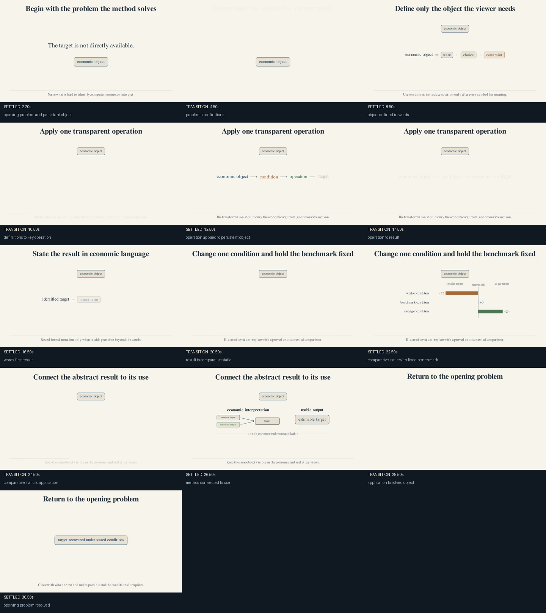

# Template catalog

Templates encode a narrative grammar, not a discipline or dataset. Pick the one
whose sequence matches the paper's contribution.

Themes are independent. Use `--theme midnight` or `--theme ivory` with any
template; the defaults below merely reproduce the contrast between the two
reference videos.

## Complete project templates

| CLI name | Best fit | Narrative sequence | Production lesson |
|---|---|---|---|
| `general` | Papers without one dominant grammar | question → object → argument → result → interpretation | Shared continuity and QA conventions |
| `mechanism-led` | Networks, equilibrium propagation, policy transmission, model channels | question → build → perturb → trace → compare → synthesize | The multimodal explainer keeps one system alive across the video |
| `agent-choice-welfare` | Choice, adjustment, treatment responses, insurance, welfare, policy value | agent → change → choices → evidence → decomposition → welfare | The diversity explainer connects one menu to evidence and welfare |
| `empirical-result-led` | Measured effects, event studies, descriptive facts, and heterogeneity | question → variation → estimate → dynamics → heterogeneity → interpretation | The diversity explainer preserves one estimand from design to evidence |
| `method-theory` | Theorems, estimators, sufficient statistics, algorithms, and identification results | problem → object → operation → result → comparative static → application | Both explainers introduce formal terms only after their economic meaning |

```bash
uv run econ-manim templates
uv run econ-manim themes
uv run econ-manim new my-paper --template mechanism-led
uv run econ-manim new my-other-paper --template agent-choice-welfare
uv run econ-manim new empirical-paper --template empirical-result-led
uv run econ-manim new method-paper --template method-theory
uv run econ-manim new light-choice-paper \
  --template agent-choice-welfare \
  --theme ivory
```

Each command creates a complete project with its own brief, storyboard,
manifest, scene skeleton, and named QA frames.

### General preview



[Watch the silent preview](../starter/preview/general_preview.mp4).

### Mechanism-led preview


[Watch the silent preview](projects/mechanism-led/preview/mechanism_led_preview.mp4).

### Agent-choice-welfare preview


[Watch the silent preview](projects/agent-choice-welfare/preview/agent_choice_welfare_preview.mp4).

### Empirical-result-led preview



[Watch the silent preview](projects/empirical-result-led/preview/empirical_result_led_preview.mp4).

### Method- or theory-led preview



[Watch the silent preview](projects/method-theory/preview/method_theory_preview.mp4).

The shorter files under `storyboards/` remain useful when a researcher wants
the narrative grammar without copying a full scene skeleton.

## Atomic recipes

Complete projects choose the argument's overall sequence. Atomic recipes solve
one local visual problem:

```bash
uv run econ-manim scenes
uv run econ-manim preview-scene empirical.coefficient-intervals --theme ivory
uv run econ-manim add-scene projects/my-paper empirical.coefficient-intervals
```

Browse the [atomic scene recipes](scenes/README.md) before building a custom
chart or route from scratch.

## What to preserve

From the multimodal format, preserve the system's spatial identity while its
state changes. From the diversity format, preserve the alternatives and their
semantic colors as the story moves from decisions to estimates and value.

Do not copy the subject matter. A node need not be a transport mode, and an
agent need not be a worker.
