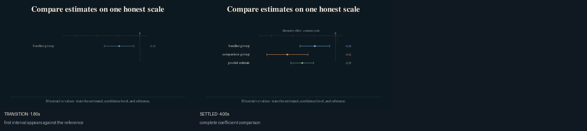
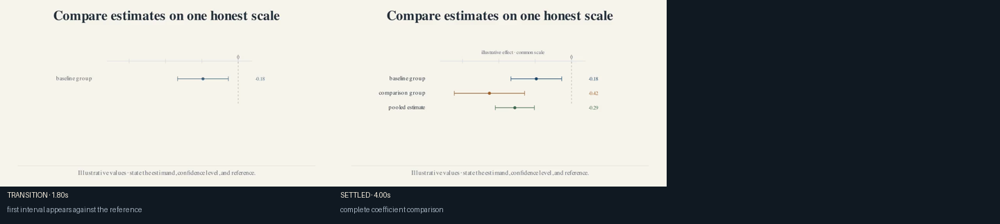

# Coefficient intervals

Use this recipe for a small set of estimates with one estimand, scale, and
reference value. Avoid it when coefficients use different outcomes, units, or
normalizations.

Inputs:

- direct row labels;
- point estimates;
- lower and upper confidence bounds;
- a shared reference value;
- the confidence level and units stated nearby.

The bundled values are illustrative.





After `econ-manim add-scene PROJECT empirical.coefficient-intervals`, import:

```python
from recipes.empirical.coefficient_intervals.recipe import (
    build_coefficient_intervals,
)
```

## Codex prompt

> **Goal:** Replace the illustrative coefficient table with the paper's
> released estimates.
>
> **Context:** Locate the result-producing replication output and the paper's
> exact estimand, units, sample, baseline, and confidence level.
>
> **Constraints:** Do not transcribe from a plotted image when a table or
> machine-readable output exists. Record the raw file and transformation.
>
> **Done when:** The plotted values reproduce the cited output, labels state a
> common comparison, and all rows remain readable in both themes.
