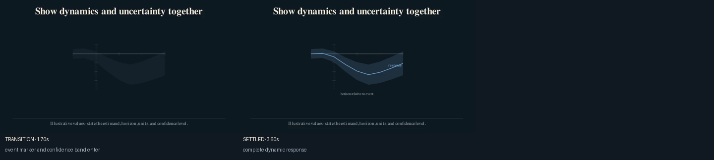
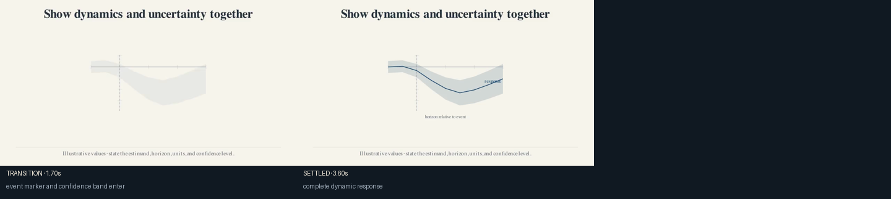

# Impulse response

Use this recipe when a response evolves over a common event-time or projection
horizon. Avoid it when series use different horizon definitions or estimands.

Inputs:

- strictly increasing horizons;
- point estimates;
- optional lower and upper confidence bounds;
- an optional event-time marker;
- the estimand, units, and confidence level stated nearby.

The bundled values are illustrative.





After `econ-manim add-scene PROJECT empirical.impulse-response`, import:

```python
from recipes.empirical.impulse_response.recipe import build_impulse_response
```

## Codex prompt

> **Goal:** Replace the illustrative dynamic response with the paper's released
> series.
>
> **Context:** Inspect the result-producing replication output and the paper's
> definition of the shock, outcome, horizon, baseline, and confidence level.
>
> **Constraints:** Preserve pre-event horizons when they are an identifying
> diagnostic. Record the exact transformation and do not infer omitted bounds.
>
> **Done when:** The plotted series reproduces the released output, uncertainty
> remains visible in both themes, and transition frames show no clipping.
