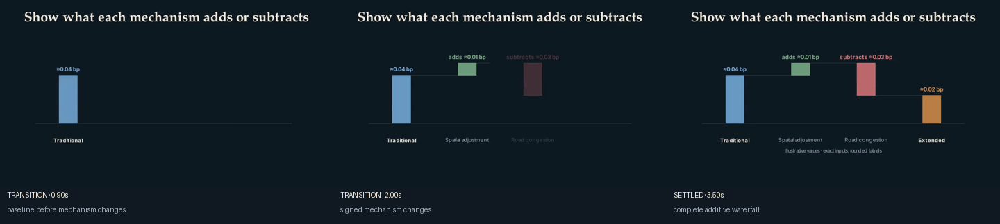
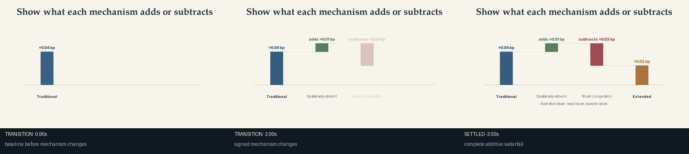

# Additive waterfall

Use this recipe when a benchmark and all mechanism contributions share one
unit. It preserves exact inputs, labels changes as amounts that add or
subtract, and computes the final level from the signed changes.

```bash
uv run econ-manim preview-scene mechanism.additive-waterfall --theme ivory
uv run econ-manim add-scene projects/my-paper mechanism.additive-waterfall
```

Adapt `data/waterfall.csv`; do not type rounded chart labels into the scene.
Use `chart.speech_phrases` when narration needs natural decimal readings.

Avoid this recipe when the model is being explained as a product of factors.
Use an incrementally built equation for that purpose.





After `econ-manim add-scene PROJECT mechanism.additive-waterfall`, import:

```python
from recipes.mechanism.additive_waterfall.recipe import build_additive_waterfall
```

## Codex prompt

> Replace the illustrative baseline and changes with exact result-producing
> values. Verify that their sum equals the reported total. Keep a common unit,
> reveal one contribution per narration cue, and explain calibration-dependent
> signs without presenting them as theoretical restrictions.
