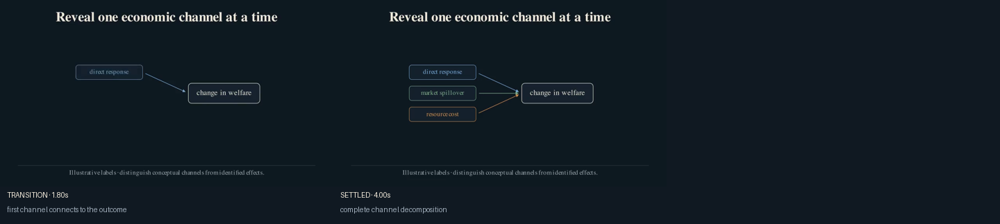
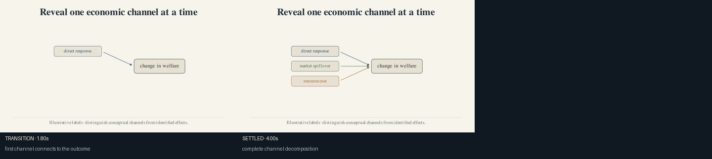

# Channel decomposition

Use this recipe when two to four economic margins contribute to one outcome.
Avoid it when the proposed channels are only different names for the same
response.

Inputs:

- two to four channel labels;
- one outcome label;
- semantic colors that remain stable elsewhere in the video.

The component exposes `channels`, `arrows`, and `outcome` for incremental
reveals. The bundled labels are illustrative.





After `econ-manim add-scene PROJECT mechanism.channel-decomposition`, import:

```python
from recipes.mechanism.channel_decomposition.recipe import (
    build_channel_decomposition,
)
```

## Codex prompt

> **Goal:** Adapt the channel decomposition to the paper's mechanism.
>
> **Context:** Read the model, estimating equations, results, and paper brief.
>
> **Constraints:** Use the paper's own economic vocabulary. Do not present an
> unverified conceptual channel as an identified empirical effect.
>
> **Done when:** Every arrow has a distinct interpretation, colors match later
> equations or results, and both partial and complete states pass visual QA.
