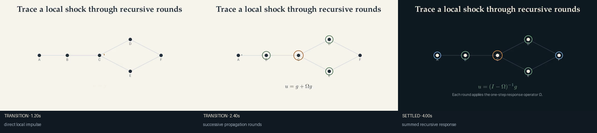
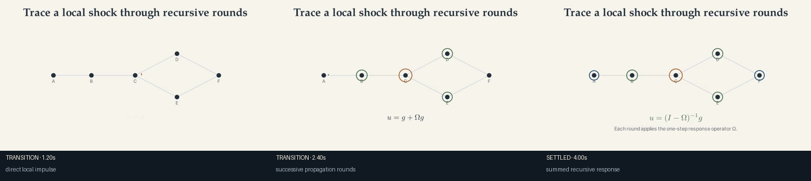

# Recursive network impulse

Use this recipe when a paper has a well-defined one-round response operator and
the audience needs to see how a local shock propagates before seeing the matrix
inverse.

```bash
uv run econ-manim preview-scene mechanism.network-impulse --theme ivory
uv run econ-manim add-scene projects/my-paper mechanism.network-impulse
```

Replace the schematic network and `data/impulse.csv` with model-consistent
rounds. State what the operator contains and what remains elsewhere in the full
equilibrium system.





After `econ-manim add-scene PROJECT mechanism.network-impulse`, import:

```python
from recipes.mechanism.network_impulse.recipe import build_network_impulse
```

## Codex prompt

> Identify the paper's local forcing and one-round linearized propagation
> operator. Reveal the direct response before later rounds. Do not call the
> entire equilibrium a Leontief system unless the model establishes that claim.
