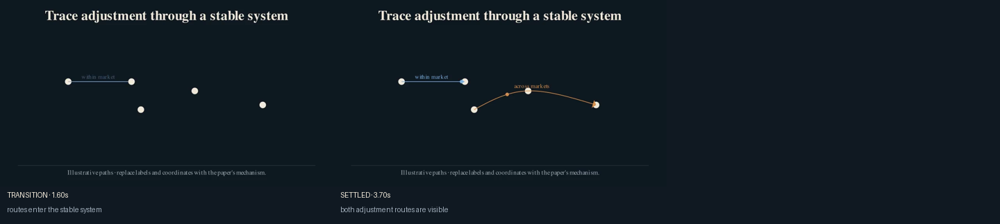
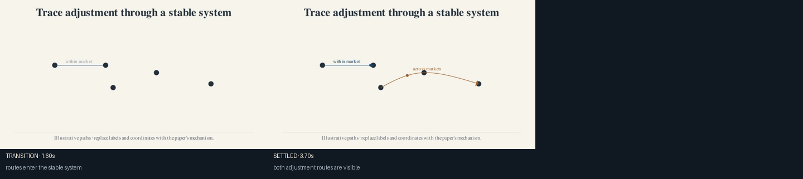

# Path flow

Use this recipe when movement across alternatives is itself part of the
economic mechanism. Avoid it when animation would merely move an icon between
unrelated panels.

Inputs:

- ordered route points;
- an economic route label;
- one semantic color per route;
- an optional custom token.

The recipe exposes `flow.path`, `flow.label`, `flow.token`, and
`flow.travel_animation()`. The bundled coordinates are illustrative.





After `econ-manim add-scene PROJECT mechanism.path-flow`, import:

```python
from recipes.mechanism.path_flow.recipe import build_path_flow
```

## Codex prompt

> **Goal:** Adapt the path-flow recipe to the paper's adjustment mechanism.
>
> **Context:** Read the paper brief, storyboard, TeX definitions, and relevant
> replication files before changing route labels or values.
>
> **Constraints:** Preserve one stable system, use direct economic labels, and
> classify every factual input in `data_manifest.toml`.
>
> **Done when:** Each route has a distinct economic meaning, the token follows
> the visible path, and settled and transition frames have been inspected.
