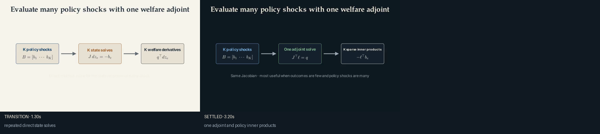
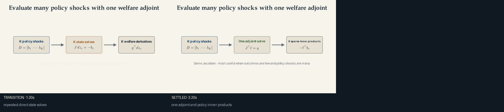

# Adjoint policy sweep

Use this recipe when a paper evaluates many local or policy-specific shocks for
one or a few scalar outcomes.

```bash
uv run econ-manim preview-scene method.adjoint-sweep --theme ivory
uv run econ-manim add-scene projects/my-paper method.adjoint-sweep
```

The recipe deliberately avoids claiming that the Jacobian need not be built.
Both methods use the same equilibrium derivative. The adjoint changes the
number and orientation of the linear solves.





After `econ-manim add-scene PROJECT method.adjoint-sweep`, import:

```python
from recipes.method.adjoint_sweep.recipe import build_adjoint_sweep
```

## Codex prompt

> Verify the paper's residual Jacobian, forcing vectors, and welfare gradient.
> Show the direct state solves first, then replace them with the transposed
> adjoint solve. State the dimensions and the condition under which the adjoint
> reduces computation. Do not display an explicit matrix inverse unless the
> paper actually forms one.
